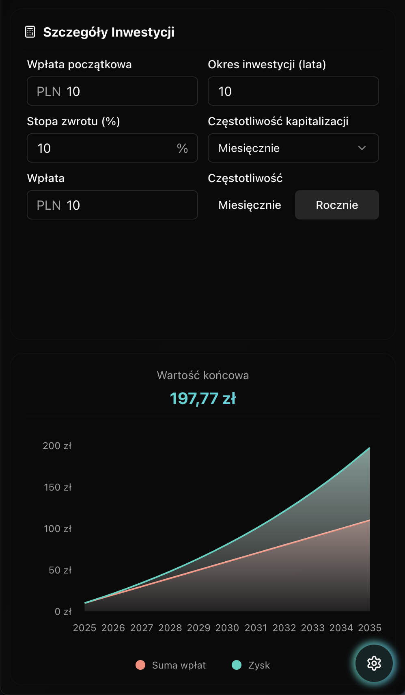
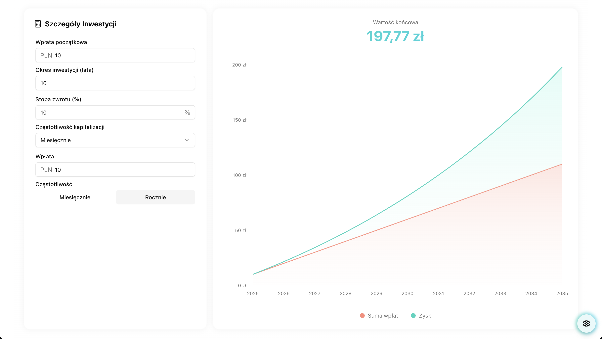
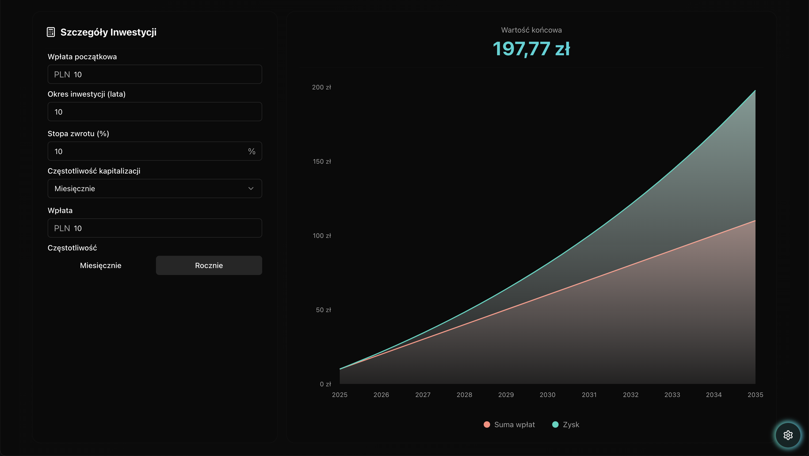

# 💰 Compound Interest Calculator

A sleek and intuitive calculator that helps you visualize your wealth growth through the power of compound interest! Built with Next.js and modern web technologies.

✨ Desktop View of the Calculator ✨

## 🌟 Features

-   📊 Real-time compound interest calculations
-   🎨 Beautiful, interactive charts
-   🌓 Light/Dark mode
-   🌍 Multi-currency support
-   🔄 Regular contribution options
-   📱 Fully responsive design
-   🚀 Lightning-fast performance

  
  
📱 Mobile Experience

## 🚀 Quick Start

1. Clone the repository:
   git clone https://github.com/cichowlasp/-CIC-Compound-Interest-Calculator.git

2. Install dependencies:
   npm install

3. Run the development server:
   npm run dev

4. Open [http://localhost:3000](http://localhost:3000) 🎉

## 🛠️ Built With

-   ⚡️ [Next.js](https://nextjs.org) - React Framework
-   🎨 [Tailwind CSS](https://tailwindcss.com) - Styling
-   📊 [Recharts](https://recharts.org) - Charts
-   ✨ [Shadcn/ui](https://ui.shadcn.com) - UI Components

## 📸 Screenshots

| Light Mode                             | Dark Mode                            |
| -------------------------------------- | ------------------------------------ |
|  |  |

## 🎯 Usage

1. Enter your initial deposit 💵
2. Set your expected rate of return 📈
3. Choose contribution frequency 🔄
4. Watch your wealth grow! 🚀

## 🤝 Contributing

Contributions are welcome! Feel free to:

-   🐛 Report bugs
-   💡 Suggest features
-   🔧 Submit pull requests

## 🙏 Acknowledgments

-   📊 Financial calculation formulas
-   🎨 Design inspiration
-   🚀 Next.js community

---

  Made with ❤️ by Piotr Cichowlas
  
  [Live Demo](https://cic-piotr-cichowlas-projects.vercel.app/) | [GitHub](https://github.com/cichowlasp/-CIC-Compound-Interest-Calculator)

